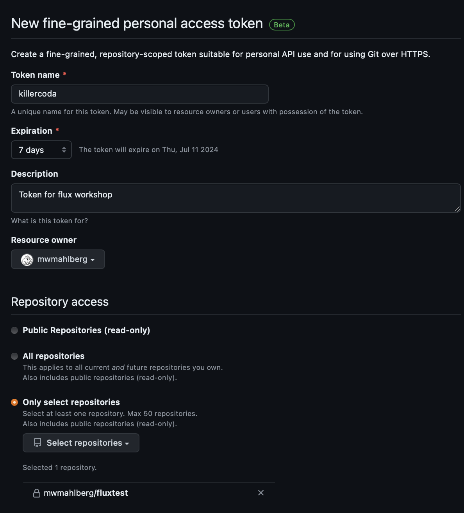

Now, we set up git and the gh client:

1. [Create a personal access token (PAT) at Github](https://github.com/settings/personal-access-tokens/new).

    The basic settings should look similar to this:

    

    The only permission required for that token is:

    

    After clicking "Generate Token", your token will be shown -- ***once***.

    **Note it down**.
    
2. Export your PAT in the shell:

    `export MY_GH_TOKEN=<YourPAT>`{{copy}}

3. Use your PAT to authenticate with the gh client:

    `echo $MY_GH_TOKEN | gh auth login -p https -h github.com --with-token`{{exec}}

